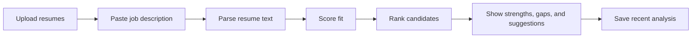
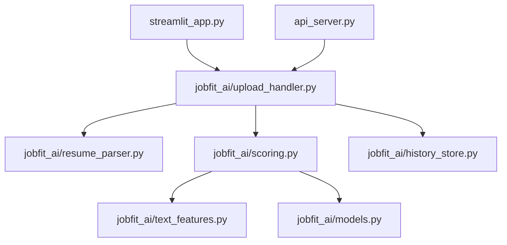

<div align="center">

# JobFit AI

### Explainable resume-to-job matching for internship applicants

[](https://jobfit-ai-u9cgsvbwqbduxbhfpbsbls.streamlit.app/)
[](runtime.txt)
[](streamlit_app.py)
[](jobfit_ai/scoring.py)

Compare resumes against a target job description, rank fit, and explain the score with transparent matching signals.

**Live app:** https://jobfit-ai-u9cgsvbwqbduxbhfpbsbls.streamlit.app/

</div>

---

## Overview

JobFit AI helps students and early-career candidates understand how well a resume lines up with a role. Upload one or more resumes, paste a job description, and get a ranked analysis with keyword matches, missing skills, resume structure feedback, and concrete suggestions.

This project was built as a practical portfolio piece for AI, software engineering, and product internships. It focuses on a real workflow: tailoring resumes without relying on vague advice or black-box scores.

## Highlights

| Area | What it does |
| --- | --- |
| Resume parsing | Supports `PDF`, `DOCX`, and `TXT` uploads |
| Batch ranking | Compares multiple resumes against one job description |
| Explainable scoring | Breaks fit into semantic similarity, keyword alignment, and resume quality |
| Skill gaps | Shows missing role-specific terms from the job description |
| Resume feedback | Flags missing sections and suggests concrete improvements |
| Rewrite examples | Generates example bullets with optional OpenAI-powered rewrites |
| Observability | Tracks parse, scoring, rewrite, and total analysis latency |
| Persistence | Saves recent analyses locally with SQLite |
| Deployment | Live Streamlit app with a simple root-level entry point |
| Demo mode | Includes one-click demo job description and sample resume ranking |

## Why This Is Different

Most beginner resume matchers only count shared words. JobFit AI combines multiple signals:

- TF-IDF semantic similarity for broader text alignment
- weighted keyword matching based on job-description terms
- resume quality heuristics such as sections, bullets, and action verbs
- batch comparison for a more realistic recruiting or applicant workflow
- shared core logic that can power both the Streamlit app and FastAPI backend
- optional AI rewrite coaching when an OpenAI API key is configured

The result is still lightweight and explainable, but more useful than a basic keyword counter.

## Product Flow



## Architecture



## Tech Stack

| Layer | Tools |
| --- | --- |
| App | Streamlit |
| API | FastAPI, Uvicorn |
| ML/NLP | scikit-learn, TF-IDF, cosine similarity |
| Data | SQLite, pandas |
| Parsing | PyPDF2, DOCX XML parsing, plain text |
| Testing | Python `unittest` |
| Deployment | Streamlit Community Cloud |

## Project Structure

```text
jobfit-ai/
  jobfit_ai/
    history_store.py      # SQLite save/load logic
    models.py             # dataclass models used across the app
    resume_parser.py      # PDF, DOCX, and TXT extraction
    scoring.py            # matching and scoring logic
    text_features.py      # keyword, section, and text helpers
    upload_handler.py     # upload-to-analysis workflow
  demo/
    job_description_software_engineering_intern.txt
    resume_ethan_brooks_weak.txt
    resume_jordan_kim_strong.txt
    resume_maya_singh_moderate.txt
  scripts/
    demo_batch.py
  tests/
    test_jobfit.py
  api_server.py
  streamlit_app.py
  requirements.txt
  runtime.txt
```

## Quick Start

```bash
python -m venv .venv
.venv\Scripts\activate
pip install -r requirements.txt
streamlit run streamlit_app.py
```

Then open:

```text
http://localhost:8501
```

## Try The Demo Data

In the live app, click:

```text
Load demo job description
Run demo ranking
```

You can also run the same sample flow locally:

```bash
python scripts/demo_batch.py
```

Sample output:

```text
JobFit AI Demo Ranking
============================================================
1. Jordan Kim          67.16%  Strong    Matches: 15  Missing: 15
2. Maya Singh          50.26%  Moderate  Matches: 11  Missing: 15
3. Ethan Brooks        23.59%  Weak      Matches:  5  Missing: 15
```

## Run Tests

```bash
python -m unittest discover -s tests -v
```

## Optional API

The Streamlit app does not need the API to run. The API is included to show backend design and reusable business logic.

```bash
pip install -r requirements-api.txt
uvicorn api_server:app --reload
```

Routes:

| Method | Route | Purpose |
| --- | --- | --- |
| `GET` | `/health` | Health check |
| `GET` | `/history` | Recent analyses |
| `POST` | `/match` | Analyze one resume |
| `POST` | `/match/batch` | Analyze multiple resumes |

## Deployment

Streamlit Community Cloud settings:

| Setting | Value |
| --- | --- |
| Repository | `TJA0308/jobfit-ai` |
| Branch | `main` |
| App file | `streamlit_app.py` |
| Python | `3.13` |

No API key is required. The app runs on uploaded files and pasted job descriptions.

Optional AI rewrite suggestions can be enabled with Streamlit secrets:

```toml
OPENAI_API_KEY = "your-api-key"
OPENAI_MODEL = "gpt-4o-mini"
```

Without a key, the app still shows template rewrite examples.

When a key is configured, OpenAI rewrites are still opt-in from the app sidebar so public demo usage does not automatically spend API credits.

## Resume Bullet

```text
Built and deployed JobFit AI, a resume matching app using Python, Streamlit, SQLite, and scikit-learn to rank resumes against job descriptions and explain fit using semantic similarity, keyword alignment, and resume quality signals.
```

## What I Learned

- How to structure a Python project beyond a single script
- How to separate UI, parsing, scoring, persistence, and upload handling
- How to deploy a Streamlit app from GitHub
- How to debug dependency/runtime issues in a cloud environment
- How to add lightweight observability for latency and rewrite mode
- How to frame technical output around a real user workflow

## Roadmap

- Improve the rewrite coach with user-selected tone and bullet style
- Add vector embeddings for stronger semantic matching
- Move batch processing to a background worker if the app grows beyond Streamlit Cloud
- Add downloadable CSV or PDF reports
- Add a small evaluation dataset for score calibration
- Add screenshots and a short demo GIF to the README
- Deploy the FastAPI backend separately on Render
